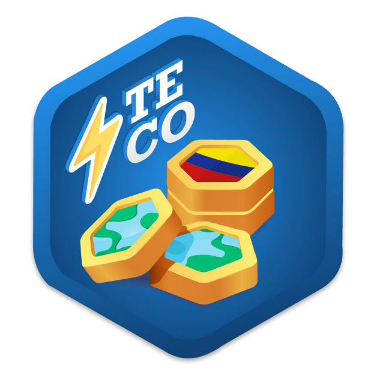

# TECO - Ecoalfabetización y Gamificación para la Construcción de Cultura Ambiental

**Landing page del proyecto de investigación TECO: una aplicación Android gamificada orientada a la ecoalfabetización sobre residuos electrónicos en la Amazonía. Desarrollada en el marco de un estudio de caso publicado en la Revista Mexicana de Investigación Educativa (RMIE).**

---

## Tabla de Contenidos

- [¿Qué es TECO?](#qué-es-teco)
- [Publicación Científica](#publicación-científica)
- [La Aplicación Android](#la-aplicación-android)
- [Sobre la Landing Page](#sobre-la-landing-page)
- [Tecnologías Utilizadas](#tecnologías-utilizadas)
- [Autores e Institución](#autores-e-institución)
- [Acceso](#acceso)

---

## ¿Qué es TECO?

**TECO** es un proyecto de investigación y desarrollo tecnológico cuyo objetivo es la construcción de cultura ambiental mediante estrategias de **ecoalfabetización** y **gamificación**. El proyecto surge como respuesta a la problemática de los residuos electrónicos en la Amazonía colombiana, una región con especial vulnerabilidad ecológica y social.

La propuesta integra el diseño de contenidos educativos sobre ecología y medio ambiente con mecánicas de juego en una aplicación móvil Android, convirtiendo el aprendizaje en una experiencia motivadora e innovadora para los estudiantes. El proyecto fue diseñado, implementado y evaluado como estudio de caso en Colombia, y sus resultados fueron publicados en una revista científica de alto impacto en el ámbito educativo latinoamericano.

---

## Publicación Científica

El artículo que sustenta este proyecto fue publicado en la **Revista Mexicana de Investigación Educativa (RMIE)**:

> **"Ecoalfabetización y gamificación para la construcción de cultura ambiental: TECO como estudio de caso"**
>
> RMIE, 2020 · Vol. 25 · Núm. 87 · pp. 1123–1148
> ISSN: 1405-6666 · ISSN-e: 2594-2271

El artículo aborda la construcción conceptual de la ecoalfabetización como categoría de análisis, la gamificación como componente esencial del diseño instruccional, y los resultados obtenidos al implementar TECO con estudiantes en el contexto amazónico colombiano.

📄 **[Leer el artículo completo](https://teco.milacho.com/articulo.html)**

---

## La Aplicación Android

TECO es una aplicación educativa para Android que combina contenido multimedia sobre ecoalfabetización con mecánicas de gamificación. Sus características principales incluyen:

🎮 **Gamificación** - Retos, actividades y juegos virtuales que hacen el aprendizaje ambiental dinámico y motivador  
🌿 **Ecoalfabetización** - Contenidos sobre residuos electrónicos, ecología y cultura ambiental en el contexto amazónico  
🏅 **Sistema de Medallas** - Reconocimientos escalonados (plástica, plata, oro y diamante) según el tiempo de interacción y los puntos obtenidos  
📱 **App Android** - Disponible para descarga directa en formato APK  
🎓 **Enfoque Pedagógico** - Estrategia didáctica diseñada bajo principios de educación ambiental e informática educativa  

---

## Sobre la Landing Page

Este repositorio contiene el código fuente de la **landing page oficial del proyecto TECO**, que funciona como punto de acceso público al ecosistema del proyecto. Desde la landing se puede:

- **Conocer el proyecto**: presentación completa de los objetivos, metodología y contexto de la investigación
- **Descargar la app**: acceso directo al APK de la aplicación Android
- **Acceder al artículo**: visualización del PDF de la publicación científica en RMIE
- **Conocer al equipo**: información sobre los autores e institución responsable del proyecto

La landing está construida con HTML, CSS y Bootstrap, desplegada en Vercel y apuntada al dominio `teco.milacho.com`.

---

## Tecnologías Utilizadas

---

## Autores e Institución

El proyecto TECO es resultado del trabajo investigativo de:

| Autor | Institución | Contacto |
|---|---|---|
| **Yois Pascuas Rengifo** | Universidad de la Amazonia | y.pascuas@udla.edu.co |
| **Haner Camilo Perea Yara** | Universidad de la Amazonia | h.perea@udla.edu.co |
| **Bernardo García Quiroga** | Universidad de la Amazonia | bgarciaquiroga@hotmail.com |

🏛️ **Universidad de la Amazonia** · Doctorado en Educación y Cultura Ambiental  
📍 Carrera 3F - Barrio Porvenir, Florencia, Caquetá, Colombia

---

## Acceso

**Visita la landing page en:** https://teco.milacho.com

Desde allí podrás descargar la aplicación Android, leer el artículo de investigación completo y conocer más sobre el proyecto.

---

### 🌿 Educar para conservar. Gamificar para transformar.

**Desarrollado con ❤️ por [hanercamilo](https://github.com/hanercamilo)**

 •  • 
